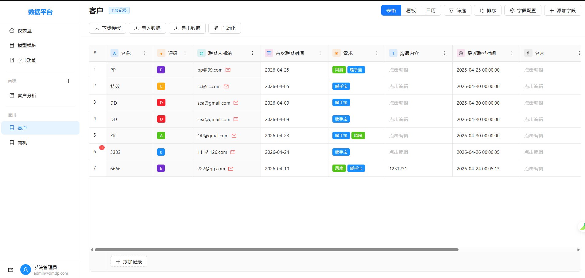
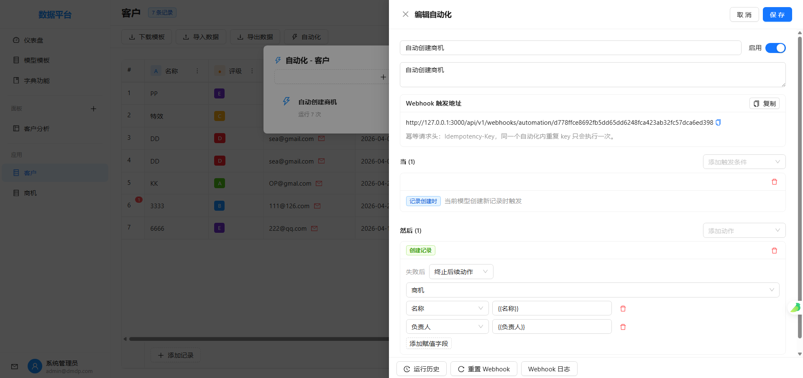
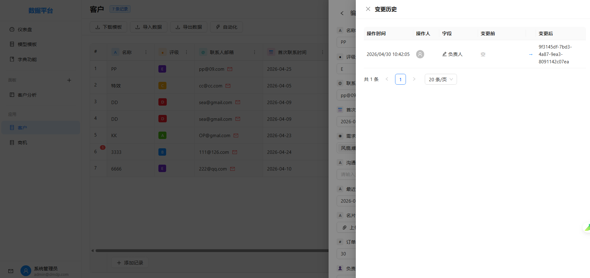
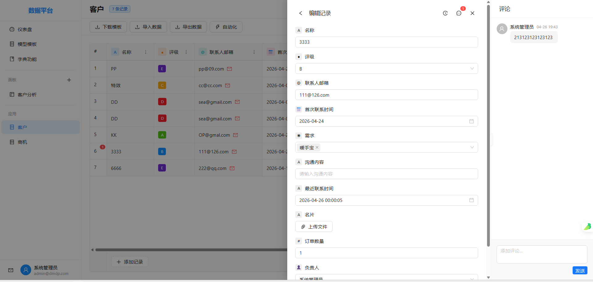
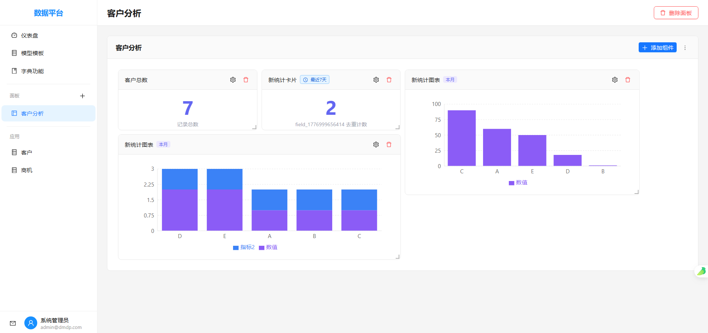
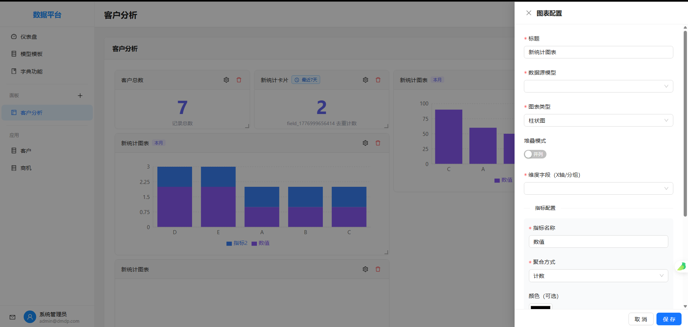

# 数据模型驱动平台

一个类似 NocoBase/API Table 的数据模型驱动平台,通过图形化界面实现数据模型的定义、管理和应用。

## 项目结构

```
.
├── backend/                # Go 后端项目
│   ├── cmd/               # 应用入口
│   ├── internal/          # 内部代码
│   │   ├── config/       # 配置管理
│   │   ├── models/       # 数据模型
│   │   ├── services/     # 业务逻辑
│   │   ├── repositories/ # 数据访问
│   │   ├── handlers/     # HTTP 处理器
│   │   ├── middleware/   # 中间件
│   │   └── utils/        # 工具函数
│   ├── pkg/              # 公共包
│   ├── config/           # 配置文件
│   └── init/             # 初始化脚本
├── frontend/              # React 前端项目
│   ├── src/
│   │   ├── api/          # API 请求
│   │   ├── components/   # 组件
│   │   ├── pages/        # 页面
│   │   ├── stores/       # 状态管理
│   │   ├── hooks/        # 自定义 Hooks
│   │   ├── utils/        # 工具函数
│   │   ├── types/        # 类型定义
│   │   └── styles/       # 样式文件
│   └── public/           # 静态资源
├── docker-compose.yml     # Docker Compose 配置
└── .env.example          # 环境变量示例

```

## 技术栈

### 后端
- Go 1.21+
- Gin (Web 框架)
- GORM (ORM)
- PostgreSQL 15+ (主数据库)
- Redis (缓存)
- JWT (认证)
- Zap (日志)

### 前端
- React 18+
- TypeScript
- Ant Design 5+
- Vite
- Zustand (状态管理)
- React Router 6
- Axios
- React Query

## 快速开始

### 1. 启动数据库服务

```bash
docker-compose up -d
```

### 2. 启动后端服务

```bash
cd backend
go mod download
go run cmd/server/main.go
```

### 3. 启动前端服务

```bash
cd frontend
npm install
npm run dev
```

### 4. 访问应用

- 前端: http://localhost:3000
- 后端 API: http://localhost:8080
- 健康检查: http://localhost:8080/health

## 环境变量

复制 `.env.example` 到 `.env` 并修改配置:

```bash
cp .env.example .env
```
## 界面












## 许可证


MIT
